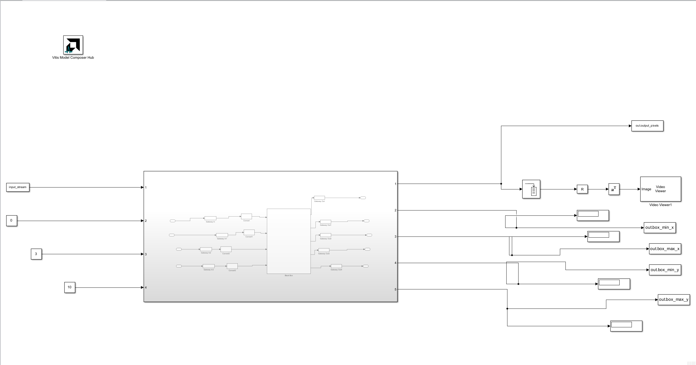
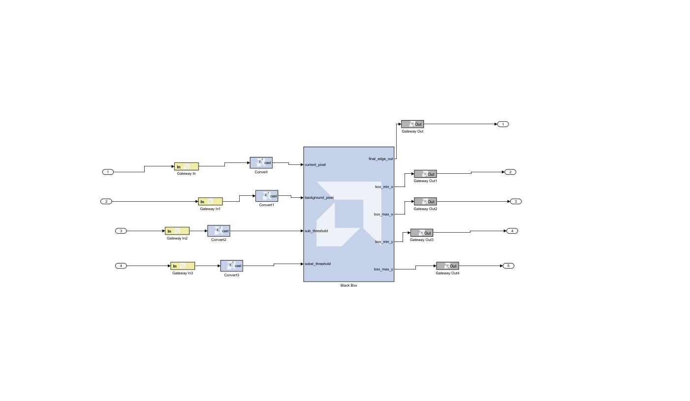
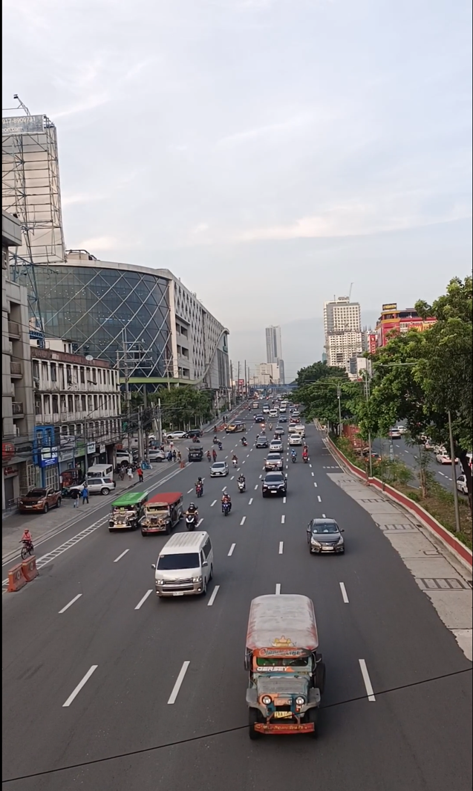
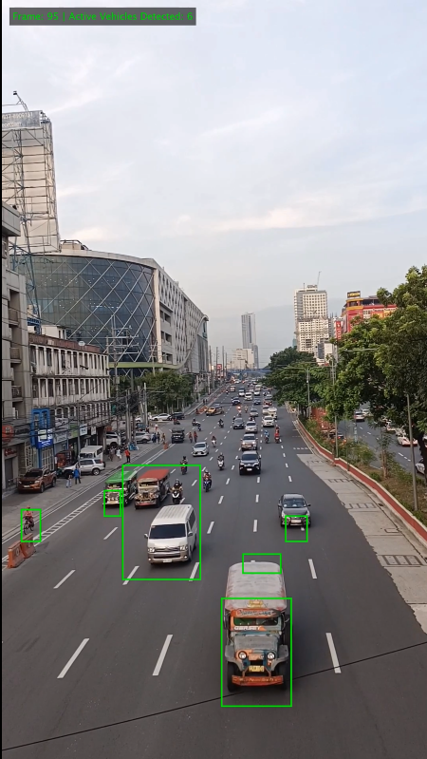

# FPGA-Oriented Object Detection using Background Subtraction

An RTL-based object detection pipeline implemented in **Verilog HDL** and verified through **MATLAB** and **Simulink**. The project demonstrates how a computer vision algorithm can be translated into a modular hardware architecture suitable for FPGA implementation.

> **Project Status:** RTL Design & Functional Verification (Simulation)

---

# Project Overview

This project implements an FPGA-oriented object detection pipeline based on the **Background Subtraction** algorithm.

The primary objective was to explore the implementation of image processing algorithms using RTL design principles while developing a modular hardware architecture that can be functionally verified through simulation.

The complete workflow includes MATLAB-based preprocessing, Verilog RTL implementation, Simulink-based functional verification, and MATLAB post-processing for output visualization.

---

# Project Workflow

```text
Input Video
      │
      ▼
MATLAB Preprocessing
      │
      ▼
Input Pixel Stream
(input_video.txt)
      │
      ▼
Verilog RTL Processing
      │
      ▼
Simulink Functional Verification
      │
      ▼
Output Pixel Stream
(output_edges.txt)

Bounding Box Coordinates
(box_coordinates.txt)
      │
      ▼
MATLAB Post-processing
      │
      ▼
Detected Output
```

---

# Simulink Verification Environment

<p align="center">

</p>

The Verilog RTL modules were integrated into MATLAB Simulink to perform functional verification of the complete object detection pipeline.

---

# RTL Processing Pipeline

<p align="center">

</p>

The processing pipeline consists of several independent RTL modules integrated into a single top-level design.

---

# RTL Modules

| Module | Description |
|----------|-------------|
| **Background Subtraction** | Performs foreground extraction by comparing the current frame with the background frame. |
| **Line Buffer** | Stores neighboring pixel values required for spatial filtering operations. |
| **Sobel Edge Detection** | Computes image gradients to enhance detected object boundaries. |
| **Bounding Box Generator** | Calculates the minimum and maximum coordinates of detected objects. |
| **Top-Level Tracking** | Integrates all RTL modules into the complete processing pipeline. |

---

# Simulation Results

The RTL simulation successfully generated:

- Foreground object detection
- Bounding box coordinates
- Processed output pixel stream

| Input Frame | Output Frame |
|-------------|--------------|
|  |  |

---

# Repository Structure

```text
fpga-object-detection-background-subtraction
│
├── rtl
│   ├── background_subs.v
│   ├── line_buffer.v
│   ├── sobel_calc.v
│   ├── tracker_box.v
│   └── top_tracking.v
│
├── matlab
│   ├── preprocess.m
│   ├── postprocess.m
│   └── ...
│
├── simulink
│   └── object_detection.slx
│
├── media
│   ├── input_demo.mp4
│   └── output_demo.mp4
│
├── images
│   ├── simulink_top_module.png
│   ├── simulink_subsystem.png
│   ├── input_frame.png
│   └── output_frame.png
│
├── docs
│   ├── Presentation.pdf
│   └── Report.pdf
│
├── test_data
│   ├── sample_input_video.txt
│   ├── sample_output_edges.txt
│   └── sample_box_coordinates.txt
│
└── README.md
```

---

# Tools & Technologies

- Verilog HDL
- Xilinx ISE
- MATLAB
- Simulink

---

# Skills Demonstrated

- RTL Design
- Modular Hardware Development
- FPGA-Oriented Image Processing
- Digital Image Processing
- Functional Verification
- MATLAB Integration
- Simulink Integration
- Hardware/Software Co-design

---

# Future Improvements

- Hardware implementation on an FPGA development board
- Resource utilization analysis
- Timing analysis and optimization
- Support for higher resolution video streams
- Performance benchmarking

---

# Documentation

The repository includes:

- Verilog RTL source code
- MATLAB preprocessing and post-processing scripts
- Simulink model
- Sample simulation datasets
- Project presentation
- Demonstration videos

---

# Note

The repository contains **sample datasets** for demonstration purposes. The complete simulation datasets are omitted due to GitHub storage limitations.

---

# Author

**Mayur B**

Electronics & Communication Engineering Student

Interested in FPGA Design • RTL Development • Digital Design • Hardware Acceleration

---

# License

This project is intended for educational and research purposes.
